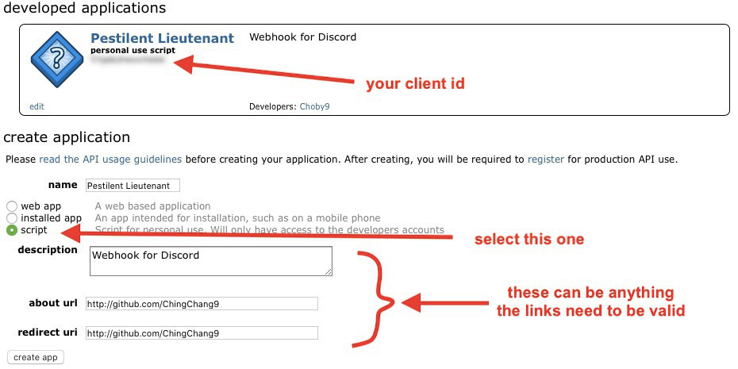

# Pestilent Lieutenant
Receive an embedded message from Discord whenever you save something on Reddit

## Install
```bash
git clone https://github.com/ChingChang9/pestilent-lieutenant.git
cd pestilent-Lieutenant
```

## How to use?
#### Create a Discord webhook
1. Go to the Discord channel you want to receive Reddit embeds
2. From the channel menu, select **Edit Channel**
3. Click on **Integrations** on the left menu
4. Click on **Webhooks** and then press the **Create Webhook** button
5. (Optional) Name the bot to whatever you prefer and set an avatar
6. Click **Copy Webhook URL** and save this link for later

Step 1 and 2 | Step 3 | Step 4
-|-|-
 |  | 

#### Create a Reddit app
1. [Create a Reddit app here](https://www.reddit.com/prefs/apps). Select "script" and put in any url and uri. It doesn't matter what you put here, as long as they are valid links
2. Save your client ID and client secret on the dashboard for later

Step 1 | Step 2
-|-
 | 

#### Create `config.json`
Head back to the repository you cloned and create `config.json` with the following fields:
```json
{
  "discordWebhook": {
    "id": yourWebhookId,
    "token": yourWebhookToken
  },
  "redditAuth": {
    "clientId": yourClientId,
    "clientSecret": yourClientSecret,
    "username": yourRedditUsername,
    "password": yourRedditPassword
  }
}
```
Field | What it is | Example
-|-|-
discordWebhook.id | <span>https://</span>discord.com/api/webhooks/**this-part-of-the-url**/long-token | 199737254929760256
discordWebhook.token | <span>https://</span>discord.com/api/webhooks/18-digit-number/**this-part-of-the-url** | 5j-0Uj72BkzYcRt1rL56wVdm7OCIixAAL-nrhLrt41QSw9yDa3jdbT8dFSZRcDjDOEEp
redditAuth.clientId | The client ID you saved from earlier | p-jcoLKBynTLew
redditAuth.clientSecret | The client secret you saved from earlier | gko_LXELoV07ZBNUXrvWZfzE3aI
redditAuth.username | Your Reddit username | Choby9
redditAuth.password | Your Reddit password | abcd1234

After creating `config.json`, you're all set! Now go ahead and run `index.js`
```bash
node .
```
and enjoy the Reddit posts while I pour this pestilence into your ear...